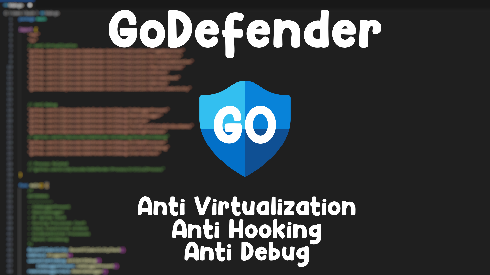

<p align="center">
  <a href="#"></a>
  <a href="#"></a>
  <a href="#"></a>
</p>

# 🛡️ GoDefender 🛡️

A powerful Go-based security toolkit designed to detect and defend against debugging, virtualization, and DLL injection attacks. GoDefender provides comprehensive protection mechanisms to make reverse engineering and analysis significantly more difficult.

**⚠️ WINDOWS ONLY - Designed for Windows systems**



## 🚀 Quick Start

### 1. Use as a Go Library in Your Project

```bash
go get github.com/psyc0dev/goDefender
```

```go
package main

import (
	"fmt"
	"os"

	godefender "github.com/psyc0dev/goDefender"
)

func main() {
	// Quick one-line check: returns true if debugger/VM/hook threat is detected
	if godefender.QuickCheck() {
		fmt.Println("Analysis environment detected. Exiting.")
		os.Exit(1)
	}

	// Or run a full diagnostic audit and inspect the report
	report := godefender.RunAudit()
	fmt.Print(report.Summary())
}
```

### 2. Standalone CLI Tool

#### Install globally via `go install`:
```bash
go install github.com/psyc0dev/goDefender/cmd/godefender@latest
```

#### Or build from source:
```bash
# Build CLI binary
go build -o GoDefender.exe ./cmd/godefender

# Run full diagnostic scan
./GoDefender.exe

# Output diagnostic report as JSON
./GoDefender.exe -json

# Apply active in-memory mitigations & scan
./GoDefender.exe -protect
```

## Features

### Anti-Virtualization & Hardware Telemetry
* **SMBIOS / ACPI Firmware Table Analysis** (`GetSystemFirmwareTable` RSMB provider analysis)
* **Hardware Resource Profiling** (Core count, RAM capacity validation)
* **High-Resolution Execution Timing Variance** (`QueryPerformanceCounter` latency analysis)
* **VMware Detection** (Video controller & driver analysis)
* **VirtualBox Detection** (Driver, file scanning, and devices)
* **KVM / QEMU / Parallels Detection** (Driver and guest artifact scans)
* **Display Refresh Rate & Resolution Analysis**
* **USB Storage Device History & Named Pipes Detection**

### Anti-Debugging
* **Direct PEB & API Debugger Detection** (`IsDebuggerPresent`, `CheckRemoteDebuggerPresent`)
* **Parent Process Validation** (`explorer.exe`, `powershell.exe`, `cmd.exe`, `windowsterminal.exe`)
* **Process & Window Title Blacklist Scanning** (OllyDbg, x64dbg, IDA Pro, WinDbg, Ghidra, etc.)
* **Critical Breakpoint Patching** (`DbgUiRemoteBreakin`, `DbgBreakPoint`)
* **Debug Filter State Protection** (`NtSetDebugFilterState`)

### Advanced API Hook Detection
* **Multi-Trampoline Inspection**: Detects NOP sleds (`0x90`), 5-byte near jumps (`0xE9`), short jumps (`0xEB`), software breakpoints (`0xCC`), 64-bit indirect jumps (`0xFF 0x25`), absolute jumps (`0x48 0xB8`), and push-ret sequences (`0x68 ... 0xC3`).

### Anti-DLL Injection & Mitigations
* **Binary Image Signature Mitigation Policy** (`MicrosoftSignedOnly` mitigation policy enforcement)
* **LoadLibrary Function Patching** (`LoadLibraryA/W/Ex`, `LdrLoadDll`)

### Quick Nutshell
- Detects most anti-anti-debugging hooking methods on common anti-debugging functions by checking for bad instructions on function addresses (most effective on x64). It also detects user-mode anti-anti-debuggers like ScyllaHide and can detect some sandboxes that use hooking to monitor application behavior/activity (like [Tria.ge](https://tria.ge/)).

## Telegram:
- https://t.me/psyc0dev

## 📜 License

This project is licensed under the MIT License - see the [LICENSE](LICENSE) file for details.

## ⚠️ Disclaimer

This software is provided for educational and legitimate security research purposes only. Use responsibly and only on systems you own or have explicit permission to test.

---

**Star this project if you found it useful! It encourages continued development and improvement.**
